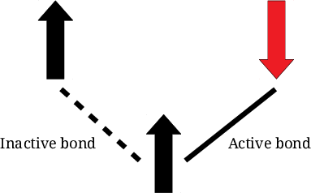
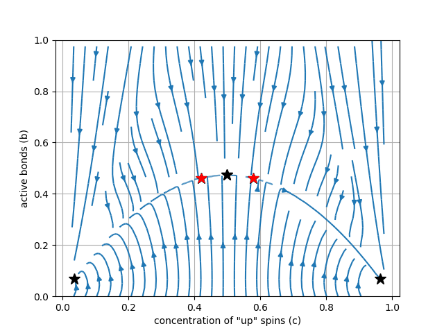
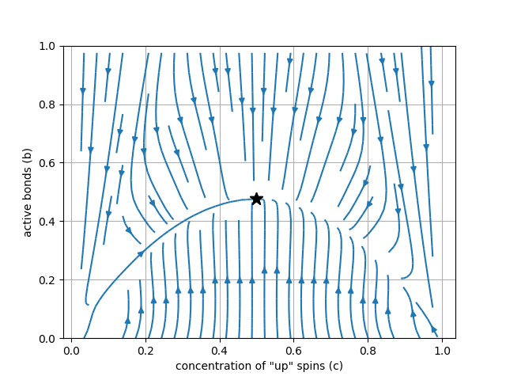
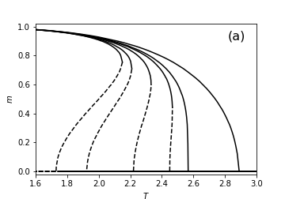
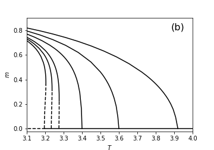
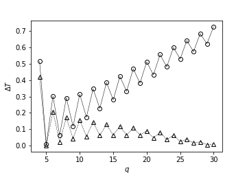
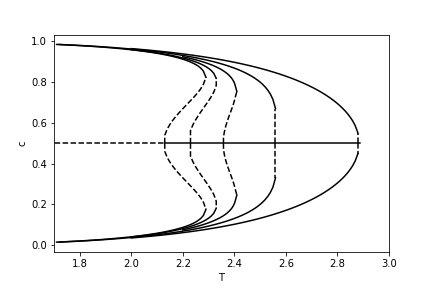
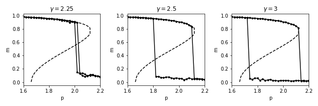

#

## 

### Pair approximation for the *q*-Ising model on monoplex and duplex networks

#### Tomasz Gradowski{.autor}
`tomasz.gradowski@pw.edu.pl`{.small}

::::::{.columns}
:::{.column width=50%}
{.foto}

#### Andrzej Krawiecki{.autor}
`akraw@if.pw.edu.pl`{.small}

:::
:::{.column width=50%}
{.foto}

#### Ania Chmiel{.autor}
`anulachmiel@gmail.com`{.small}
:::
::::::

#### Division of Complex Systems Physics, Faculty of Physics Warsaw University of Technology{.afil}

## Disclaimer

This work is **heavily** inspired by the papers from the K. Sznajd-Weron group from PWr, including:

- A. Jędrzejewski, A. Chmiel, K. Sznajd-Weron, *Phys. Rev. E* 92, 052105 (2015)
- A. Chmiel, K. Sznajd-Weron, *Phys. Rev. E* 92, 052812 (2015)
- A. Jędrzejewski, *Phys. Rev. E* 95, 012307 (2017)

##

### Overview

- Pair approximation for the *q*-Ising model on networks
    - comparison with Monte-Carlo simulations results

- Generalization of the PA method for two-layer networks

- *q*-Ising model on homogeneous duplex (PA+MC results)

- Thoughts on the heterogeneous approximation

#
## Pair approximation (PA)

::::::{.columns}
:::{.column width=33%}
{.col}
:::
:::{.column width=66%}
- **two states of nodes** ($\pm 1$, $\uparrow$/$\downarrow$)
- **two states of edges** (bonds): active bonds between nodes with oposite state, inactive bonds between nodes of the same state
:::
::::::

::::::{.columns}
:::{.column width=30%}
$\frac{\partial c}{\partial t} = F_c(c,b)$

$\frac{\partial b}{\partial t} = F_b(c,b)$
:::
:::{.column .left width=50%}
$c$ - concentration of $\uparrow$ spins

$b$ - concentration of active bonds
:::
::::::

##
### PA for networks
#### A. Jędrzejewski, *Phys. Rev. E* 95, 012307 (2017)

$c\equiv c_\uparrow=P(\uparrow)$

$1-c\equiv c_\downarrow=P(\downarrow)$
    
$b=P(\uparrow \downarrow) + P(\downarrow \uparrow) = 2 P(\uparrow \downarrow)$

$P(\uparrow \downarrow)$ - probability of selecting $\downarrow$-spin after selecting $\uparrow$-spin.
    
    
#### Conditional probabilities:

$\theta_{\uparrow} = P(\downarrow | \uparrow) = \frac{P\left( \downarrow \uparrow\right)}{P\left(\uparrow\right)}=\frac{b}{2c}$

$\theta_{\downarrow} = P(\uparrow | \downarrow) = \frac{P\left( \uparrow \downarrow\right)}{P\left(\downarrow\right)}= \frac{b}{2(1-c)}$

##

$$
\frac{\partial c}{\partial t} = \gamma^{+} -\gamma^{-}
$$

$$
\frac{\partial b}{\partial t} = \frac{2}{\langle k\rangle} \sum \limits_{\nu\in \left\{ \uparrow,\downarrow\right\}} c_{\nu} \sum \limits_{k}P(k) \sum \limits_{i=0}^{k} B(i, k, \theta_{\nu}) f_{k}\left( i,q,\hat{p}\right) (k-2i)
$$
<!--{k \choose i} \theta_{\nu}^{i} \left( 1-\theta_{\nu}\right)^{k-i}-->

$\gamma^{+}$, $\gamma^{-}$ - rates (probabilities per time unit) of elementary change of $c$ ($c \rightarrow c \pm \Delta_c$)

$f_{k}\left( i,q,\hat{p}\right)$ - flipping probability of spin with $k$ neighbors and $i$ active bonds at temperature $\hat{p}$ 

#
## q-Ising model
#### A. Jędrzejewski, A. Chmiel, K. Sznajd-Weron, *Phys. Rev. E* 92, 052105 (2015)

##

1. Randomly choose a node $j$

2. From the set of $k_j$ neighbors choose randomly and without repetitions 
a subset ${\rm nn}_{j,q}$ of its $q$ neighbors

3. Calculate the change of the local "energy" related to the potential flip of the spin $s_j$

$$
\Delta E = E(-s_j)-E(s_j)=2Js_j\sum \limits_{j^{\prime} \in {\rm nn}_{j,q}}s_{j^{\prime}}
$$

4. Flip the spin $s_{j}$ with probability given by a Metropolis-like formula
$$
w(s_j) = \min \left[ 1, e^{-\beta \Delta E} \right]
$$
5. Repeat steps (1-4) until all $N$ nodes are updated.

#
## PA for q-Ising model

$$
f_{k}\left( i,q,T\right) = \frac{1}{{k \choose q}} \sum_{l=0}^{q} {i \choose l} {k-i \choose q-l} \min \left(1, e^{ -2\beta J(q-2l)}\right)
$$

... and after transformations:
$$
\dots = \frac{1}{{k \choose i}} \sum_{l=0}^{q} {k-q \choose i-l} {q \choose l}\min \left(1, e^{ -2\beta J(q-2l)}\right)
$$

##

To increase $c$ in one step, we flip one $\downarrow$-spin to $\uparrow$.

$$
\gamma^{+}= \sum_{l=0}^{q} (1-c)  B(l,q,\theta_{\downarrow}) \min \left(1, e^{ -2\beta J(q-2l)}\right)
$$

 And similar eq. for $\gamma^{-}$.

##

#### The final equations do not depend on degree distribution $P(k)$, only $\langle k \rangle$.

For the full PA equations for *q*-Ising model check: 

A. Chmiel, T. Gradowski, A. Krawiecki, *Int. J. of Mod. Phys. C* 29, 1850041 (2018)

## Stability of fixed points

## 

#### ferromagnetic (FM) and paramagnetic (PM) f.p. 

$q=4$, $\langle k \rangle =20$, $T=1.90$

::::::{.columns}
:::{.column width=50%}

:::
:::{.column width=50%}

- **$T<T_{c}^{(1)}$: stable FM, unstable PM**

- $T_{c}^{(1)}<T<T_{c}^{(2)}$

- $T>T_{c}^{(2)}$

:::
::::::

## 

#### ferromagnetic (FM) and paramagnetic (PM) f.p. 

$q=4$, $\langle k \rangle =20$, $T=1.95$

::::::{.columns}
:::{.column width=50%}

:::
:::{.column width=50%}

- $T<T_{c}^{(1)}$: stable FM, unstable PM

- **$T_{c}^{(1)}<T<T_{c}^{(2)}$: bistability (both FM and PM points stable)**

- $T>T_{c}^{(2)}$

:::
::::::

## 

#### ferromagnetic (FM) and paramagnetic (PM) f.p. 

$q=4$, $\langle k \rangle =20$, $T=2.20$

::::::{.columns}
:::{.column width=50%}

:::
:::{.column width=50%}

- $T<T_{c}^{(1)}$: stable FM, unstable PM

- **$T_{c}^{(1)}<T<T_{c}^{(2)}$: bistability (both FM and PM points stable)**

- $T>T_{c}^{(2)}$: stable PM, no FM points
:::
::::::

## 

#### ferromagnetic (FM) and paramagnetic (PM) f.p. 

$q=4$, $\langle k \rangle =20$, $T=2.25$

::::::{.columns}
:::{.column width=50%}

:::
:::{.column width=50%}

- $T<T_{c}^{(1)}$: stable FM, unstable PM

- $T_{c}^{(1)}<T<T_{c}^{(2)}$: bistability

- **$T>T_{c}^{(2)}$: stable PM, no FM points**

Subcritical pitchfork bifurcation
:::
::::::

##

### Continous and discontinous phase transitions 

::::::{.columns}
:::{.column width=50%}

$q=4$

$\langle k \rangle =50, 20, 10, 7, 6, 4$
:::
:::{.column width=50%}

$q=5$

$\langle k \rangle=1000, 100, 50, 20, 10, 5$
:::
::::::

##

### Comparison with Monte-Carlo simulations

$q=4$

::::::{.columns}
:::{.column width=50%}

$\langle k \rangle = 6$
:::
:::{.column width=50%}

$\langle k \rangle = 40$
:::
::::::

The same results for ERG, RRG and SF networks with $\gamma \geq 3$.

##

### "Oscillating hysteresis" effect

Width of the hysteresis loop, $\Delta T$ vs. $q$,  $\langle k \rangle = 50$ (triangles) and $\langle k \rangle = 1000$
(circles).

## PA for *q*-Ising model ...

### ... works for:

- Erdős–Rényi graphs
- random regular graphs
- scale-free graphs with $\gamma \geq 3$

### ... does not work for:

- scale-free graphs with $\gamma \lt 3$

# Multiplex generalization

## Pair approximation for duplex network

- Two fully overlapping networks (layers) $A$ and $B$ with joint degree distribution $P\left( k^{(A)}, k^{(B)}\right)$.

- One concentration $c$, but two different active bond concentrations $b^{(A)}$ and $b^{(B)}$.

- Spin flip rate: $f_{k^{(A)},k^{(B)}}\left( i^{(A)},i^{(B)},q,\hat{p}\right)$

## I apologize for the next slide 😔

##
$$
\frac{\partial c}{\partial t} = \gamma^{+}-\gamma^{-}
$$

$$
\frac{\partial b^{(A)}}{\partial t} = \frac{2}{\langle k^{(A)}\rangle} \sum_{j\in \left\{ \uparrow,\downarrow\right\}} c_{j}
\sum_{k^{(A)},k^{(B)}} P\left( k^{(A)}, k^{(B)}\right) 
$$

$$
\times
\sum_{i^{(A)}=0}^{k^{(A)}} \sum_{i^{(B)}=0}^{k^{(B)}}
B(i^{(A)}, k^{(A)}, \theta_{j}^{(A)})
B(i^{(B)}, k^{(B)}, \theta_{j}^{(B)})
$$

$$
\times f_{k^{(A)},k^{(B)}}\left( i^{(A)},i^{(B)},q,\hat{p}\right) \left( k^{(A)}-2i^{(A)}\right)
$$

<!-- {k^{(A)} \choose i^{(A)} } \theta_{j}^{(A)i^{(A)}}\left( 1-\theta_{j}^{(A)}\right)^{k^{(A)}-i^{(A)}}
{k^{(B)} \choose i^{(B)} } \theta_{j}^{(B)i^{(B)}}\left( 1-\theta_{j}^{(B)}\right)^{k^{(B)}-i^{(B)}} -->
... and a complementary equation for $b^{(B)}$.

# LOCAL vs. GLOBAL

## Multiplex generalization. `LOCAL&AND` vs. `GLOBAL&AND`.

#### A. Chmiel, K. Sznajd-Weron, *Phys. Rev. E* 92, 052812 (2015)

##

::::::{.columns}
:::{.column width=50%}
### `LOCAL&AND`
- Check the result of the spin-flip rule on each layer (for local $q$-panels from all the layers)

- If the results are consistent, apply the rule

:::
:::{.column width=50%}
### `GLOBAL&AND`
- Create one global panel consisting neighbors from all the layers ($q$ neighbors from each layer)

- Apply the spin-flip rule for the global panel
:::
::::::

## PA for `LOCAL&AND` dynamics

$$
f_{k^{(A)},k^{(B)}}\left( i^{(A)},i^{(B)},q,\hat{p}\right)=
f_{k^{(A)}}\left( i^{(A)},q,\hat{p}\right) f_{k^{(B)}}\left( i^{(B)},q,\hat{p}\right)
$$

### for *q*-Ising:

$$
f_{k^{(A)}}\left( i^{(A)},q,T\right) =
$$

$$
= \frac{1}{{k^{(A)} \choose i}} \sum_{l=0}^{q} {k^{(A)}-q \choose i^{(A)}-l} {q \choose l}
\min \left(1, e^{ -2\beta J(q-2l)}\right)
$$

... and similar formula for $f_{k^{(B)}}\left( i^{(B)},q,T\right)$

## Flip rates for q-Ising model

$$
\gamma^{+} = (1-c) 
\left[ \sum_{l=0}^{q} B(l, q, \theta^{(A)}_{\downarrow})
 \min \left(1, e^{ -2\beta J(q-2l)}\right) \right]
$$

$$
\times
\left[ \sum_{l^{\prime}=0}^{q} B(l^{\prime}, q, \theta^{(B)}_{\downarrow})
\min \left(1, e^{ -2\beta J(q-2l^{\prime})}\right) \right]
$$

... and similar formula for $\gamma^{-}$.

## Too muh equationz!!! 😫

# Simple case. Homoduplex? 😕

##

- We consider two fully overlapping layers with the same topologies: $P(k^{(A)})=P(k^{(B)})$. Then: $\langle k^{(A)} \rangle=\langle k^{(B)} \rangle$.

- Due to symmetry of the $\dot b^{(A)}$ and $\dot b^{(B)}$ rates:

    - $\theta_{j}^{(A)} =\theta_{j}^{(B)} =\theta_{j}$ $\quad \quad j\in \left\{ \uparrow,\downarrow\right\}$
    - $b^{(A)} = b^{(B)} = b$

## `LOCAL&AND`
#### I'm sorry...
<!-- $$
\frac{\partial c}{\partial t} &=&\gamma^{+}-\gamma^{-}
$$ -->

$$
\frac{\partial b^{(A)}}{\partial t} = \frac{2}{\langle k^{(A)}\rangle} \sum_{j\in \left\{ \uparrow,\downarrow\right\}} c_{j}
$$

$$
\times \sum_{l=0}^{q} B(l, q, \theta_{j}^{(A)})
\left[  \langle k^{(A)}\rangle -2 \left( \langle k^{(A)}\rangle -q\right) \theta_{j}^{(A)} -2l\right]
\min \left(1, e^{ -2\beta J(q-2l)}\right)
$$

$$
\times \sum_{l^{\prime}=0}^{q} 
B(l^{\prime}, q, \theta_{j}^{(B)})
\min \left(1, e^{ -2\beta J(q-2l^{\prime})}\right)
$$

## `LOCAL&AND`
### $q=6..2$, $k=50$

## `LOCAL&AND`

### Some boring plots

Example result for scale-free network $(\gamma=3)$, $\langle k \rangle =50$
The same results for higher values of $\gamma$, ERG and RRG.

## `GLOBAL&AND`

The equations obtained for the `GLOBAL&AND` duplex dynamics are in complete agreement with those for monoplex with $q ^\prime = 2q$ and $\langle k ^\prime \rangle = 2 \langle k \rangle$

## Don't run!
### No more equations!

## `GLOBAL&AND`
### $q=2$ , $\langle k \rangle=2..6$

Example for $q=2$ , $\langle k \rangle = 50$

##

### ...but it doesn't work for scale-free networks with small $\gamma$.

# What's next? 🤔

## Let's solve 150'000 differential equations!
 
### Heterogeneous approximation: Gleeson equations

#### J.P. Gleeson, Binary-State Dynamics on Complex Networks: Pair Approximation and Beyond, *Phys. Rev. X* 3 (2013)

- done for $q$-voter model
- great agreement with MC results for ERR, RRG and SF with $\gamma \geq 3$
- poor agreement for SF with $\gamma < 3$
- possible solution for partially overlapping layers

#

## Conclusions

- Pair approximation gives valid results for a wide range of topologies
- ... but not sufficient for scale-free networks with $\gamma< 3$
- possible multplex generalization

#
##
### References

- A. Chmiel, T. Gradowski, A. Krawiecki, *Int. J. of Mod. Phys. C* 29, 1850041 (2018) ([doi](https://doi.org/10.1142/S0129183118500419))

- T. Gradowski, A. Krawiecki, Pair approximation for multiplex networks (in preparation)

- A. Jędrzejewski, A. Chmiel, K. Sznajd-Weron, *Phys. Rev. E* 92, 052105 (2015)

- A. Chmiel, K. Sznajd-Weron, *Phys. Rev. E* 92, 052812 (2015)

- A. Jędrzejewski, *Phys. Rev. E* 95, 012307 (2017)

- J.P. Gleeson, *Phys. Rev. X* 3, 021004 (2013)

- Slides background: [github.com/VincentGarreau/particles.js](https://github.com/VincentGarreau/particles.js)

